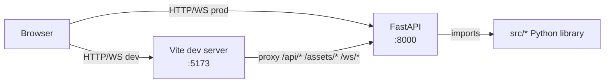
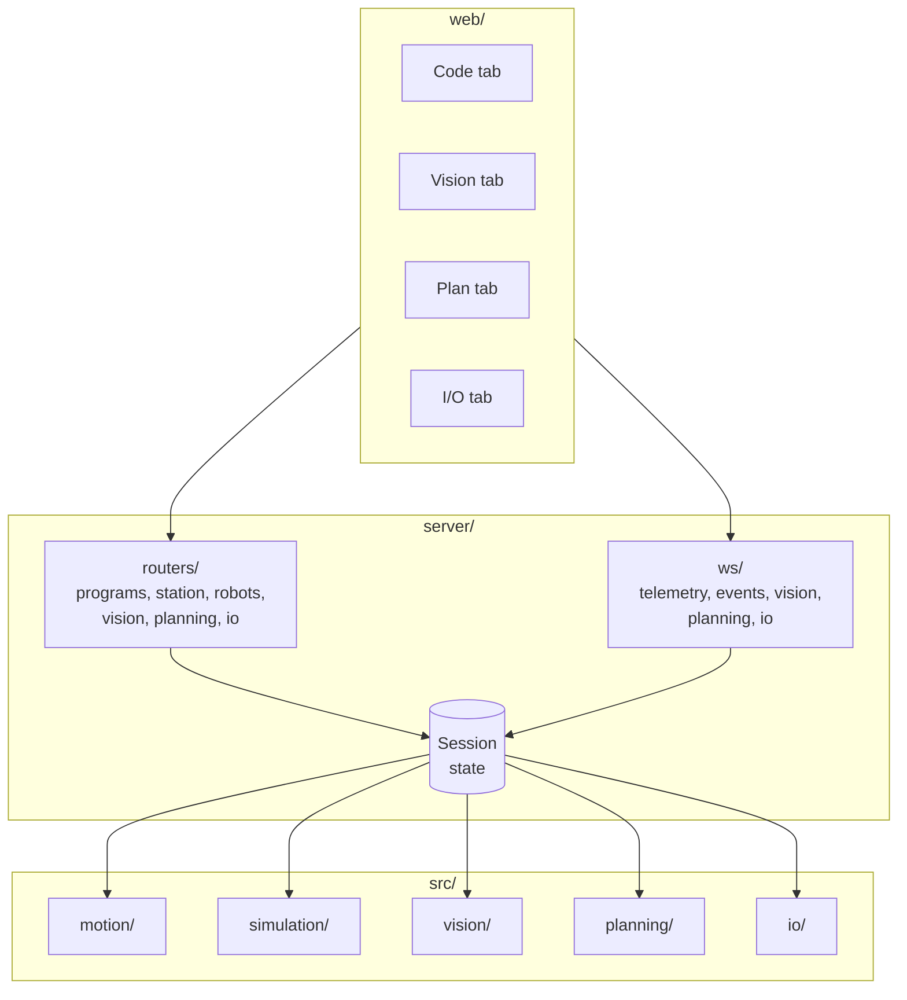
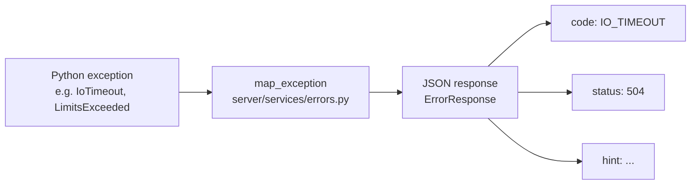

# POC-RobotArm Architecture

This document is the top-level architecture reference for POC-RobotArm. It is written for a developer reading the code cold — someone who needs to understand how the Python library, the FastAPI server, and the React frontend fit together before touching any of them.

---

## 1. Repository layout

```
POC-RobotArm/
├── src/          Python library (the engine)
├── server/       FastAPI application
├── web/          Vite + React + R3F frontend
├── tests/        pytest suite
├── docs/         Markdown user and tester docs
├── examples/     Runnable end-to-end demos
├── assets/       URDF files, license data
└── scripts/      UAT harness (uat_run.py)
```

### Top-level directories

| Directory | Description |
|-----------|-------------|
| `src/` | Vendor-neutral Python library: motion IR, simulation, vision, planning, industrial I/O, post-processors, toolpath CAM, kinematics, drivers. |
| `server/` | FastAPI app that wraps `src/*` in REST and WebSocket endpoints; owns session state; serves static assets. |
| `web/` | Vite + React + R3F single-page application; communicates with the server over HTTP and WebSocket. |
| `tests/` | pytest suite; 70+ test files covering all subsystems; gated by markers and env variables. |
| `docs/` | Markdown user docs: `INSTALL.md`, `UAT_CHECKLIST.md`, `IO.md`, `UAT_REPORT_TEMPLATE.md`, etc. |
| `examples/` | Copy-pasteable Python demos that produce visible artefacts (`.mod` files, JSON stations, etc.). |
| `assets/` | Hand-written URDF files for UR5 and ABB IRB 1200; `LICENSES.md`. |
| `scripts/` | `uat_run.py` — automated UAT harness invoked by `make uat`. |

### `src/` subpackages

| Package | Description |
|---------|-------------|
| `motion/` | Vendor-neutral IR (`ir.py`), recorder, player, path interpolator, frame composition, limits, manipulability. |
| `simulation/` | PyBullet desktop simulator: engine, thread-safe bridge, GUI loop. |
| `drivers/` | `Driver` Protocol; SimBridge adapter; `SimSampledPathDriver`; ABB RWS online driver. |
| `post/` | Code emitters: ABB RAPID (`.mod`), KUKA KRL (`.src`), UR Script (`.script`). |
| `robots/` | Robot catalog (Panda, UR5, IIWA, ABB IRB 1200); DH builders; joint limits. |
| `kinematics/` | FK/IK solvers (roboticstoolbox). |
| `vision/` | OpenCV capture, YOLOv11 detection, hand-eye calibration, grasp estimation. |
| `planning/` | OMPL/pyroboplan samplers, Drake optimisation, TOPP-RA time-parameterisation, scene and IK pipeline. |
| `io/` | `IoAdapter` ABC; Modbus TCP/RTU, OPC-UA, MQTT adapters; `IoRuntime` event broker; in-process simulators. |
| `station/` | Virtual station scene graph (frames, tools, workpieces, fixtures, IO); JSON I/O. |
| `toolpath/` | CAM: STL/OBJ/DXF intake, toolpath operations (raster, polyline-follow, curve-on-surface), redundancy DP optimizer. |
| `collision/` | Headless PyBullet collision checker used by toolpath and planning. |
| `llm/` | Ollama agent, tool definitions, fake deterministic client for CI. |
| `ui/` | PySide6 desktop UI (deprecated; retained until web reaches full feature parity). |
| `visualization/` | Matplotlib FK/IK plots. |

### `server/` subpackages

| Package | Description |
|---------|-------------|
| `routers/` | FastAPI routers: `health`, `assets`, `programs`, `robots`, `station`, `vision`, `planning`, `io`. |
| `ws/` | WebSocket handlers: `telemetry`, `events`, `vision`, `planning`, `io`. |
| `services/` | Business logic: `session`, `sim`, `vision`, `planning`, `io`, `programs`, `errors`. |
| `models/` | Pydantic wire models: `errors`, `motion`, `catalog`, `runtime`, `station`, `vision`, `planning`, `io`. |
| `state/` | *(The session singleton lives in `services/session.py`; there is no separate `state/` package.)* |

---

## 2. Process model

The entire application runs in a single Python process. The library is imported directly by the server at startup; there is no subprocess or IPC boundary between the FastAPI app and `src/*`.



**Development**: Vite runs at `:5173`. All `/api/*`, `/assets/*`, and `/ws/*` paths are proxied to the FastAPI server at `:8000` (configured in `web/vite.config.ts`). CORS is enabled in the server only when `POC_DEV_CORS=1` is set; allowed origin is `http://localhost:5173`.

**Production**: Vite builds to `web/dist/`. The FastAPI app serves the built files as static assets and handles all routes directly.

**Concurrency model**: FastAPI runs on a single asyncio event loop (single worker). All PyBullet work is submitted through `SimBridge` — a `queue.Queue[Command]` drained on the PyBullet GUI tick. The FastAPI app is not thread-safe; do not spawn multiple uvicorn workers.

### Start commands

```bash
# Server
make server                    # uvicorn server.main:create_app --factory --reload

# Web dev server (separate terminal)
cd web && pnpm install && make web   # Vite at http://localhost:5173
```

---

## 3. Subsystems

The five subsystems map onto the phase roadmap. Each owns a `src/<name>/` library package, a server router (one or more files under `server/routers/`), a WebSocket handler (under `server/ws/`), and a tab in the web UI.



### 3a. Motion and Simulation

**Purpose**: Build, store, run, and post-process vendor-neutral motion programs; drive a headless PyBullet simulator.

**Key modules**:
- `src/motion/ir.py` — the IR type system (`Program`, `Procedure`, `Move`, `IOOp`, `Wait`, `Comment`, `SetSignal`, `WaitSignal`, `IfSignal`). All types are frozen dataclasses. JSON round-trips via `dump`/`load`.
- `src/motion/path.py` — time-parameterised trajectory interpolator (`interpolate_program` → `SampledPath`); handles MOVE\_J, MOVE\_L, MOVE\_C, TCP/RTCP modes.
- `src/motion/limits.py` — per-robot velocity/acceleration limit validation; raises `LimitsExceeded` with per-sample violation detail.
- `src/motion/frames.py` — TCP/RTCP pose composition; scene-graph frame walk.
- `src/simulation/` — PyBullet wrapper (`RobotArmSim`), thread-safe bridge (`SimBridge`), GUI loop.
- `src/drivers/` — `Driver` Protocol; `SimSampledPathDriver` wraps the sim driver and passes trajectories through the interpolator.
- `src/post/` — `RAPIDPost`, `KRLPost`, `URScriptPost`; share one `Post` Protocol; emit from the same `Program`.

**Server REST endpoints** (prefix `/api`):
- `GET  /api/programs` — list stored programs
- `GET  /api/programs/{id}` — get program model
- `POST /api/programs/{id}/post` — emit post-processed source (body: `{"vendor": "rapid"|"krl"|"urscript"}`)
- `POST /api/programs/{id}/run` — schedule a simulated run; returns `{"run_id": str}`
- `GET  /api/programs/runs/{run_id}` — run status
- `POST /api/programs/runs/{run_id}/stop` — cancel a run
- `GET  /api/robots/catalog` — list available robots
- `POST /api/station/robots` — spawn a robot (lazy-initialises `SimRuntime`)
- `DELETE /api/station/robots/{id}` — remove a robot
- `GET  /api/station` — current station JSON
- `POST /api/station/new` / `load` / `save` — station lifecycle

**WebSocket**: `/ws/telemetry` — `TelemetryFrame` JSON at ~30 Hz after the client sends `{"subscribe": "robot/<id>"}`. `/ws/events` — station-level events (see Section 4).

**Web**: The Code tab shows emitted RAPID/KRL/URScript. The 3D Viewport (R3F) shows the URDF mesh and live joint state from telemetry. The Jog panel drives individual joints.

**Out of scope**: Real-robot online control is implemented (`src/drivers/abb/rws_client.py`) but not yet exposed via the web UI or server.

### 3b. Vision

**Purpose**: Capture camera frames, run YOLOv11 object detection, calibrate cameras, estimate grasp poses.

**Key modules**:
- `src/vision/capture.py` — OpenCV camera capture; supports real devices and fake sources.
- `src/vision/detection.py` — YOLOv11 detector wrapper (`ultralytics`); also a colour-blob detector for environments without GPU.
- `src/vision/calibration.py` — intrinsic calibration (ChArUco); `src/vision/hand_eye.py` — hand-eye calibration.
- `src/vision/grasp.py` — pixel-to-world grasp pose estimation with IK preview.

**Server REST endpoints** (prefix `/api/vision`):
- `POST /cameras` — register a camera
- `GET  /cameras` / `DELETE /cameras/{name}`
- `GET  /cameras/{name}/snapshot` — single JPEG
- `GET  /cameras/{name}/stream` — MJPEG stream (multipart/x-mixed-replace)
- `POST /cameras/{name}/calibrate/intrinsic` — batch intrinsic calibration
- `POST /cameras/{name}/calibrate/hand-eye` — hand-eye calibration
- `POST /cameras/{name}/intrinsics` / `extrinsics` — bootstrap setters
- `POST /cameras/{name}/charuco_pose` — live pose estimate
- `POST /detectors` — register a detector
- `GET  /detectors` / `DELETE /detectors/{name}`
- `POST /detectors/{name}/run` — one-shot detection
- `POST /detectors/{name}/start` / `stop` — live detection loop
- `POST /grasp_preview` — IK preview for a grasp pose

**WebSocket**: `/ws/vision/detections` — `LiveDetectionFrame` JSON (bounding boxes, class labels, confidences). Clients filter to one camera with `{"subscribe": "camera/<name>"}`.

**Web**: The Vision tab shows the MJPEG stream and overlaid bounding boxes from the detections WebSocket.

**Out of scope**: 3D point-cloud reconstruction.

### 3c. Planning

**Purpose**: Collision-aware sampling-based motion planning; time-parameterised trajectory output compatible with the program executor.

**Key modules**:
- `src/planning/samplers.py` — OMPL/pyroboplan RRT and RRT\* planners.
- `src/planning/optimizer.py` — Drake-based trajectory optimisation.
- `src/planning/parameteriser.py` — TOPP-RA time-parameterisation.
- `src/planning/ik.py` — IK pipeline with warm-start from current joint angles.
- `src/planning/scene.py` — collision scene builder from station fixtures.
- `src/planning/pipeline.py` — orchestrates the full plan-request lifecycle.
- `src/planning/budgets.py` — timeout and cancellation tokens (`PlanTimeout`, `PlanCancelled`).

**Server REST endpoints** (prefix `/api/planning`):
- `POST   /plans` — schedule a plan; returns `{"plan_id": str}`
- `GET    /plans` — list all plan records
- `GET    /plans/{plan_id}` — get one record
- `POST   /plans/{plan_id}/cancel` — cancel in-flight plan
- `GET    /plans/{plan_id}/trajectory` — trajectory when completed
- `POST   /plans/{plan_id}/execute` — hand trajectory to the simulator

**WebSocket**: `/ws/planning/progress` — `PlanProgressFrame` JSON on every stage transition. Clients filter to one plan with `{"subscribe": "plan/<plan_id>"}`.

**Web**: The Plan tab shows planner configuration, live stage progress, and a trajectory preview.

**Out of scope**: Full multi-body collision meshes. The planner uses URDF primitives and capsule approximations for robot links.

### 3d. Industrial I/O

**Purpose**: Connect programs running in the executor to physical hardware over Modbus TCP/RTU, OPC-UA, and MQTT. Expose signal reads, writes, and live streaming to the web.

**Key modules**:
- `src/io/adapter.py` — `IoAdapter` ABC; `AdapterCapabilities` bitmask.
- `src/io/adapters/` — concrete adapters: `modbus_tcp.py`, `modbus_rtu.py`, `opcua.py`, `mqtt.py`.
- `src/io/runtime.py` — `IoRuntime`: manages named connections, serialises writes, broadcasts `IoEvent` to subscribers.
- `src/io/types.py` — `IoEvent`, `SignalSpec`, `ModbusTcpConfig`, `OpcUaConfig`, `MqttConfig`, etc. Stdlib-only; always importable.
- `src/io/errors.py` — typed exceptions: `IoConnectionError`, `IoNotConnected`, `IoProtocolError`, `IoSignalKindMismatch`, `IoTimeout`, `IoUnknownSignal`, `IoUnavailable`.
- `src/io/simulators/` — in-process simulators for all four protocols (used by `test_io_e2e_demo.py`).
- `src/motion/ir.py` — `SetSignal`, `WaitSignal`, `IfSignal` IR steps; `SignalOp` enum.

The executor in `server/routers/programs.py` detects I/O steps and routes them through `IoRuntime`. If `io_runtime` is `None` when an I/O step is reached, the run fails immediately with `IO_NOT_INITIALIZED`.

**Server REST endpoints**: see [`docs/IO.md`](docs/IO.md#rest-endpoints) for the full reference. Summary:
- Connection management: `POST/GET/DELETE/reconnect` under `/api/io/connections`
- Signal I/O: `read` and `write` per signal
- Cached values: `GET /api/io/values`, `GET /api/io/connections/{name}/values`

**WebSocket**: `/ws/io/stream` — `IoEventModel` JSON on every event. Filter to one connection with `{"subscribe": "connection/<name>"}`.

**Web**: The I/O tab shows a signal map editor (`SignalMapEditor`), live value stream (`IoValueStream`), and connection status indicators.

**Not duplicated here**: Protocol reference table, signal kind semantics, adapter config shapes, and full error code list are all in [`docs/IO.md`](docs/IO.md).

**Out of scope**: SCADA / historian persistence, alarm log.

### 3e. Learning (exploratory)

**Purpose**: Reinforcement learning and imitation learning research wrappers. Not yet exposed via the server or web.

The `src/learning/` package does not exist in the current codebase. It is planned for Phase 6 and will include Stable-Baselines3 wrappers, LeRobot ACT/Diffusion Policy integration, and a Hugging Face dataset adapter.

**Out of scope**: Production training infrastructure. The learning module is a research track.

---

## 4. Cross-cutting concerns

### Session state

`server/services/session.py` — module-level singleton, created once in the `lifespan` context manager (`server/main.py`) and torn down on shutdown.

```python
class Session:
    station: Station                         # current scene graph
    station_path: Optional[str]              # last save path
    sim_runtime: Optional[SimRuntime]        # None until first robot spawn
    vision_runtime: Optional[VisionRuntime]  # None until first camera register
    planning_runtime: Optional[PlanningRuntime]
    io_runtime: Optional[IoRuntime]          # None until first io/connections POST
    runs: dict[str, RunRecord]               # run_id → status
    run_tasks: dict[str, asyncio.Task]       # run_id → background task
    assets: dict[str, _AssetRecord]          # asset_id → imported CAD
    lock: asyncio.Lock                       # serialises mutating REST ops
    _events: asyncio.Queue[dict]             # feeds /ws/events subscribers
    _event_subscribers: set[asyncio.Queue]
```

All four runtime fields start as `None` and are lazily initialised:
- `sim_runtime` — on `POST /api/station/robots`
- `vision_runtime` — on `POST /api/vision/cameras`
- `planning_runtime` — on `POST /api/planning/plans` (or when a program run requests `planner="rrt"`)
- `io_runtime` — on `POST /api/io/connections` (via `get_or_create_io_runtime`)

The `lock` serialises mutations from REST handlers. WS handlers read session state without the lock; Python's GIL protects simple attribute reads. The app is single-process single-event-loop — do not run multiple uvicorn workers.

### Error contract

`server/services/errors.py` provides two public functions:

- `http_error(status_code, code, detail, hint=None)` — builds an `HTTPException` whose `detail` is a serialised `ErrorResponse`. FastAPI returns it verbatim as JSON: `{"detail": "...", "code": "...", "hint": "..."}`.
- `map_exception(exc)` — translates a domain exception to `(http_status, ErrorResponse)`. Called by the global exception handler in `server/main.py`.



**Error code table**:

| Code | HTTP | Source |
|------|------|--------|
| `ROBOT_UNKNOWN` | 404 | `KeyError` from robot catalog |
| `PROGRAM_UNKNOWN` | 404 | Program not found |
| `RUN_UNKNOWN` | 404 | Run record not found |
| `PLAN_UNKNOWN` | 404 | Plan record not found |
| `ASSET_NOT_FOUND` | 404 | `FileNotFoundError` |
| `VALIDATION_ERROR` | 422 | `ValueError` from dataclass `__post_init__` |
| `PLANNING_UNAVAILABLE` | 422 | Planning libs not installed |
| `IO_SIGNAL_KIND_MISMATCH` | 422 | Wrong signal kind for read/write |
| `IO_UNAVAILABLE` | 422 | `[io]` extra not installed |
| `NOT_SUPPORTED` | 501 | `NotImplementedError` |
| `IO_PROTOCOL_ERROR` | 502 | Protocol-level failure from adapter |
| `SIM_DISCONNECTED` | 503 | Simulator not initialised |
| `IO_CONNECTION_FAILED` | 503 | Adapter could not connect |
| `IO_NOT_CONNECTED` | 503 | Connection present but not active |
| `PLANNING_CANCELLED` | 409 | Plan cancelled before completion |
| `PLANNING_NO_SOLUTION` | 409 | Sampler found no path |
| `PLANNING_IK_UNREACHABLE` | 409 | IK failed for goal pose |
| `PLANNING_LIMITS_EXCEEDED` | 409 | Post-plan limits violated |
| `LIMITS_EXCEEDED` | 409 | Motion path exceeds robot limits |
| `SIM_TIMEOUT` | 504 | `TimeoutError`/`FuturesTimeoutError` |
| `IO_TIMEOUT` | 504 | Signal wait timed out |
| `PLANNING_TIMEOUT` | 504 | Plan ran out of time budget |
| `IO_SIGNAL_UNKNOWN` | 404 | Signal name not in map |
| `INTERNAL_ERROR` | 500 | Anything else |

Additional codes emitted by routers (not in `map_exception`): `IO_BAD_CONFIG`, `IO_CONNECTION_EXISTS`, `IO_CONNECTION_UNKNOWN`, `PLANNING_BAD_CONFIG`, `PLANNING_FAILED`, `VISION_*` codes (camera/detector not found, missing calibration, dependency missing).

For the full IO-specific error codes and their trigger conditions, see [`docs/IO.md`](docs/IO.md).

### WebSocket event taxonomy

All WS endpoints other than the MJPEG stream send JSON objects. The `type` field discriminates the frame kind. Clients receive events passively unless they send a subscribe message.

| Endpoint | Frame `type` values | Subscribe message | Notes |
|----------|---------------------|-------------------|-------|
| `/ws/telemetry` | `TelemetryFrame` (robot state, ~30 Hz) | `{"subscribe": "robot/<id>"}` | Old frames dropped on slow clients; queue depth 4 |
| `/ws/events` | `robot_spawned`, `robot_removed`, `program_emitted`, `import_completed`, `run_started`, `run_completed`, `run_failed`, `error` | none | Station-level mutations; queue depth 64 |
| `/ws/vision/detections` | `LiveDetectionFrame` (bboxes, labels, confidence) | `{"subscribe": "camera/<name>"}` | Old frames dropped; queue depth 8 |
| `/ws/planning/progress` | `PlanProgressFrame` (stage, progress %) | `{"subscribe": "plan/<plan_id>"}` | Heartbeat every 500 ms; queue depth 8 |
| `/ws/io/stream` | `connection_changed`, `value_changed`, `write_ack`, `error` | `{"subscribe": "connection/<name>"}` | Queue depth 64; high-rate |

The `/api/vision/cameras/{name}/stream` endpoint is **not** a WebSocket. It is an HTTP MJPEG stream (`multipart/x-mixed-replace; boundary=frame`) that pushes raw JPEG bytes.

### IR step types

The complete set of types registered in `_TYPE_REGISTRY` (`src/motion/ir.py`, line 534):

| Type | Category | Semantics |
|------|----------|-----------|
| `Program` | Container | Top-level container; holds tools, wobjs, procedures. |
| `Procedure` | Container | Named subroutine (RAPID `PROC`, KRL `DEF`, URScript `def`). |
| `Move` | Motion | Single motion primitive; discriminated by `MoveKind`. |
| `MoveKind.MOVE_J` | Motion | Joint-interpolated move to a `PoseTarget` or `JointTarget`. |
| `MoveKind.MOVE_L` | Motion | Cartesian-linear move to a `PoseTarget`. |
| `MoveKind.MOVE_C` | Motion | Circular-arc move through `circ_via` to a `PoseTarget`. |
| `MoveKind.MOVE_ABS_J` | Motion | Absolute joint-space move to a `JointTarget`. |
| `IOOp` | Legacy I/O | Digital I/O operation (SET, PULSE, WAIT\_HIGH, WAIT\_LOW). Pre-Phase 4; use `SetSignal`/`WaitSignal` for new programs. |
| `Wait` | Timing | Time-based or named-signal wait (mutually exclusive: `seconds` xor `signal`). |
| `Comment` | Annotation | Free-form text echoed into post-processed output. |
| `SetSignal` | I/O (Phase 4) | Write a value to a named connection/signal pair via `IoRuntime`. |
| `WaitSignal` | I/O (Phase 4) | Block until `signal <op> value` becomes true; optional timeout. |
| `IfSignal` | I/O (Phase 4) | Branch on a live signal read; `then_body` / `else_body` are recursive `ProcedureStep` tuples. |
| `ToolData` | Data | TCP definition (xyz, quaternion, mass, `robhold`). |
| `WObjData` | Data | Workobject / user frame definition. |
| `SpeedData` | Data | Velocity profile (TCP mm/s, orientation deg/s, optional acceleration caps). |
| `ZoneData` | Data | Blend zone: `FINE` (exact stop) or `RADIUS` (circular blend). |
| `ConfigData` | Data | ABB-style axis configuration (cf1/cf4/cf6/cfx); ignored by non-ABB posters. |
| `JointTarget` | Target | Pure joint-space target (radians). |
| `PoseTarget` | Target | Cartesian target (xyz metres, wxyz unit quaternion). |

`SignalOp` values for `WaitSignal`/`IfSignal` predicates: `EQ`, `NEQ`, `GT`, `GTE`, `LT`, `LTE`.

All types are `frozen=True` dataclasses. JSON serialisation uses a `__type__` discriminator key for all union fields.

### Testing strategy

Tests live in `tests/`. The suite is discovered via `testpaths = ["tests"]` in `pyproject.toml`.

**Markers** (registered in `pyproject.toml`):

| Marker | What it gates | Run condition |
|--------|--------------|---------------|
| `gui` | Tests that open a real display (PyBullet GUI, PySide6) | `RUN_GUI_TESTS=1` env var; module-level skip otherwise |
| `vision` | Tests requiring `opencv-contrib-python` | Marker declared; no auto-skip wired in yet |
| `planning` | Tests requiring the `[planning]` extra | `pytestmark = pytest.mark.planning`; no auto-skip wired in |
| `io` | Tests requiring the `[io]` extra (some need `mosquitto`) | `pytestmark = pytest.mark.io`; no auto-skip wired in |

**E2E exit-gate tests** are additionally gated by env variables:

| Test file | Gate |
|-----------|------|
| `test_io_e2e_demo.py` | `IO_E2E=1` |
| `test_planning_e2e_demo.py` | `PLANNING_E2E=1` |
| `test_gui_smoke.py` | `RUN_GUI_TESTS=1` |
| `test_ui_smoke.py` | `RUN_GUI_TESTS=1` |

`make test` runs the headless suite without any env gates. `make uat` runs `scripts/uat_run.py` which orchestrates a broader acceptance harness.

**Note**: The `headless` marker is declared in `pyproject.toml` but no tests currently carry it. It exists as a reserved gate for future CI separation.

---

## 5. Phased delivery

| Phase | What landed |
|-------|-------------|
| 0 — Foundation | Python 3.12 floor; FastAPI skeleton (`GET /health`, WS stub); Vite + React + R3F scaffold; Makefile; README. |
| 1 — Web parity | Session state; REST + WS telemetry; 3D viewport with URDF loader; outliner, code preview, jog panel; path interpolator (`SampledPath`); `SimSampledPathDriver`; post-processor acceleration emission. |
| 2 — Vision pipeline | `src/vision/` (OpenCV capture, YOLOv11, hand-eye calibration); MJPEG stream endpoint; web Vision tab. |
| 3 — Advanced planning | `src/planning/` (OMPL/pyroboplan, Drake, TOPP-RA); planning REST + WS; web Plan tab. |
| 4 — Industrial I/O ✅ | `src/io/` (Modbus TCP/RTU, OPC-UA, MQTT behind `IoAdapter` ABC); `IoRuntime` event broker; `SetSignal`/`WaitSignal`/`IfSignal` IR steps; FastAPI REST + WS stream; web I/O tab with signal map editor. |
| 5 — SO-101 + LeRobot + Docker | SO-101 FeetechMotorsBus driver; MuJoCo RL backend; web jog/teleop panel; first Docker image. (planned) |
| 6 — RL research track | `src/learning/` with Stable-Baselines3, LeRobot ACT/Diffusion Policy; HF dataset adapter; inference endpoint. (planned) |

---

## 6. Reference: where to look

| Question | Where to look |
|----------|--------------|
| How does the app start up? | `server/main.py` — `create_app()`, `_lifespan()` |
| What fields does the session hold? | `server/services/session.py` — `Session.__init__` |
| How does a domain exception become an HTTP error? | `server/services/errors.py` — `map_exception`, `http_error` |
| What IR types exist and what do they encode? | `src/motion/ir.py` — `_TYPE_REGISTRY`, dataclass definitions |
| What REST routes does the IO subsystem expose? | `server/routers/io.py` module docstring; full detail in `docs/IO.md` |
| How does the Vite proxy work? | `web/vite.config.ts` |
| What pytest markers are registered? | `pyproject.toml` — `[tool.pytest.ini_options]` |
| What robot models are available? | `src/robots/catalog.py` — `list_specs()` |
| How does path interpolation work? | `src/motion/path.py` — `interpolate_program`, `SampledPath` |
| How does the program executor handle I/O steps? | `server/routers/programs.py` — `_execute_io_step`, `_run_program_task` |
