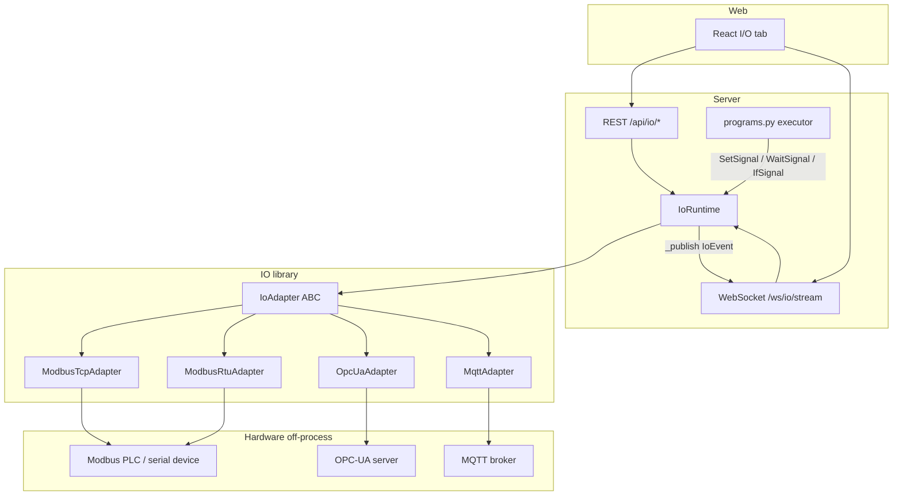

# Industrial I/O Reference (Phase 4)

## Overview

The `src/io/` package adds hardware I/O to the POC-RobotArm server. A single
async `IoAdapter` ABC (`src/io/adapter.py`) defines the protocol surface —
`connect`, `watch`, `read`, `write`, `disconnect` — and four concrete subclasses
implement it for Modbus TCP, Modbus RTU, OPC-UA, and MQTT. The `IoRuntime`
(`src/io/runtime.py`) owns all active connection slots for a session: it spawns
a per-connection `_watch_loop` task, serialises writes via a per-slot
`asyncio.Lock`, caches the most-recent value for every signal, and fans events
out to WebSocket subscriber queues. The program executor (`server/routers/programs.py`)
calls `IoRuntime.write`, `IoRuntime.wait_for_signal`, and `IoRuntime.read` when
it encounters `SetSignal`, `WaitSignal`, and `IfSignal` steps in a program IR.

## Architecture



## Protocol reference

| Protocol | Library | Config class | Default port | Address format | Signal kinds |
|----------|---------|-------------|--------------|----------------|--------------|
| Modbus TCP | `pymodbus` | `ModbusTcpConfig` | 502 | `coil:<n>`, `discrete:<n>`, `holding:<n>`, `input:<n>` | digital, analog |
| Modbus RTU | `pymodbus` | `ModbusRtuConfig` | serial device | same as Modbus TCP | digital, analog |
| OPC-UA | `asyncua` | `OpcUaConfig` | 4840 | `i=<n>`, `ns=<n>;i=<n>`, `s=<tag>`, `ns=<n>;s=<tag>` | digital, analog |
| MQTT | `aiomqtt` | `MqttConfig` | 1883 | topic string, e.g. `robot/cycles` | digital, analog |

Modbus registers 0-based. `coil` and `discrete` are 1-bit (digital); `holding`
and `input` are 16-bit unsigned (analog). OPC-UA Phase 4 is anonymous-only —
`OpcUaConfig.username` / `password` are accepted but not used. MQTT values are
published and received as plain text; the adapter coerces incoming payloads to
`bool` for digital signals and `float` for analog signals.

### Config dataclasses (`src/io/types.py`)

```python
from src.io.types import ModbusTcpConfig, ModbusRtuConfig, OpcUaConfig, MqttConfig

# Modbus TCP
ModbusTcpConfig(host="192.168.1.10", port=502, unit_id=1, timeout_s=3.0)

# Modbus RTU (serial)
ModbusRtuConfig(device="/dev/ttyUSB0", baudrate=19200, parity="N",
                stopbits=1, bytesize=8, unit_id=1, timeout_s=3.0)

# OPC-UA (anonymous)
OpcUaConfig(url="opc.tcp://plc.local:4840/", namespace=2, timeout_s=5.0)

# MQTT
MqttConfig(host="broker.local", port=1883, client_id="robotarm",
           keepalive_s=60, qos=1, timeout_s=5.0)
```

### Signal spec (`src/io/types.py`)

```python
from src.io.types import SignalSpec, SignalKind

SignalSpec(
    name="start_button",          # logical name used in program IR
    kind=SignalKind.DIGITAL_IN,   # digital_in / digital_out / analog_in / analog_out
    address="coil:0",             # protocol-specific address
    poll_interval_s=0.1,          # Modbus poll rate; None = adapter default
    scale=1.0,                    # applied on analog read: value = raw * scale + offset
    offset=0.0,
)
```

`digital_in` and `analog_in` are read-only; writing to them raises
`IoSignalKindMismatch` (HTTP 422).

## REST endpoints

All paths are under `/api/io/`. Every error response carries `{"code": "IO_*",
"detail": "..."}`.

### Connection management

| Method | Path | Description |
|--------|------|-------------|
| `POST` | `/api/io/connections` | Create and connect. Body: `IoConnectionCreateRequest`. Returns `IoConnectionStatusModel` (201). |
| `GET` | `/api/io/connections` | List all connections. Returns `list[IoConnectionStatusModel]`. |
| `GET` | `/api/io/connections/{name}` | Get one connection by name. |
| `DELETE` | `/api/io/connections/{name}` | Disconnect and remove. Returns `{"ok": true}`. |
| `POST` | `/api/io/connections/{name}/reconnect` | Disconnect then reconnect with same config and signal map. |
| `PUT` | `/api/io/connections/{name}/signals` | Atomically replace the signal map. Body: `list[SignalSpecModel]`. Restarts the watch loop. |

#### Create request shape

```json
{
  "name": "mb_floor",
  "config": {
    "protocol": "modbus_tcp",
    "host": "192.168.1.10",
    "port": 502,
    "unit_id": 1,
    "timeout_s": 3.0
  },
  "signals": [
    {
      "name": "start_button",
      "kind": "digital_in",
      "address": "coil:0",
      "scale": 1.0,
      "offset": 0.0,
      "poll_interval_s": 0.1
    }
  ]
}
```

The `protocol` discriminator in `config` selects the concrete config model:
`"modbus_tcp"`, `"modbus_rtu"`, `"opcua"`, or `"mqtt"`.

#### Connection status shape

```json
{
  "name": "mb_floor",
  "config": { "protocol": "modbus_tcp", "host": "...", "port": 502, ... },
  "status": "open",
  "last_error": null,
  "connected_at": 1234567890.123,
  "signals": [...]
}
```

`status` is one of `"disconnected"`, `"connecting"`, `"open"`, `"error"`,
`"closing"`.

### Signal I/O

| Method | Path | Description |
|--------|------|-------------|
| `POST` | `/api/io/connections/{name}/signals/{signal}/read` | Live read from the adapter. Returns `IoValueSnapshotModel`. |
| `POST` | `/api/io/connections/{name}/signals/{signal}/write` | Write a value. Body: `{"value": <bool|int|float>}`. Returns `WriteSignalResponse`. |

#### Value snapshot shape

```json
{
  "connection": "mb_floor",
  "signal": "start_button",
  "kind": "digital_in",
  "value": 0,
  "monotonic_s": 12345.678
}
```

#### Write response shape

```json
{
  "connection": "mb_floor",
  "signal": "done_lamp",
  "value": true,
  "monotonic_s": 12345.789
}
```

### Cached values

| Method | Path | Description |
|--------|------|-------------|
| `GET` | `/api/io/values` | All cached last values across all connections. Returns `list[IoValueSnapshotModel]`. |
| `GET` | `/api/io/connections/{name}/values` | Cached last values for one connection. |

The cache is updated by the `_watch_loop` on every value-changed event from the
adapter. A `GET /values` call never blocks on the adapter; it reads the
in-memory snapshot.

### Error contract

| Code | HTTP status | Cause |
|------|-------------|-------|
| `IO_BAD_CONFIG` | 422 | Dataclass `__post_init__` rejected the config or signal spec |
| `IO_CONNECTION_EXISTS` | 409 | A connection with that name is already registered |
| `IO_CONNECTION_UNKNOWN` | 404 | No connection with that name exists |
| `IO_SIGNAL_UNKNOWN` | 404 | Signal name not in the connection's signal map |
| `IO_SIGNAL_KIND_MISMATCH` | 422 | Write value incompatible with signal kind (e.g. `float` to `digital_out`), or attempt to write a read-only signal |
| `IO_NOT_CONNECTED` | 503 | Connection slot status is not `open` |
| `IO_CONNECTION_FAILED` | 503 | Adapter `connect()` failed (TCP refused, OPC-UA timeout, etc.) |
| `IO_PROTOCOL_ERROR` | 502 | Protocol-level fault from remote device (Modbus exception, OPC-UA `BadUserAccessDenied`) |
| `IO_TIMEOUT` | 504 | Adapter call exceeded configured timeout |
| `IO_UNAVAILABLE` | 422 | `[io]` extra not installed |
| `IO_NOT_INITIALIZED` | 500 | Program step reached an I/O step before an `IoRuntime` was created |

## WebSocket protocol

**Endpoint:** `ws://localhost:8000/ws/io/stream`

The server opens the connection immediately. If no `IoRuntime` exists yet the
connection stays open but receives no frames until one is created.

### Outbound frame shape

Every `IoEvent` the runtime publishes is forwarded as a JSON frame. The lib's
`kind` field maps to `type` on the wire:

```json
{
  "type": "connection_changed",
  "connection": "mb_floor",
  "signal": null,
  "value": null,
  "status": "open",
  "error_code": null,
  "error_message": null,
  "monotonic_s": 12345.678
}
```

```json
{
  "type": "value_changed",
  "connection": "mb_floor",
  "signal": "start_button",
  "value": true,
  "status": null,
  "error_code": null,
  "error_message": null,
  "monotonic_s": 12346.001
}
```

```json
{
  "type": "write_ack",
  "connection": "mb_floor",
  "signal": "done_lamp",
  "value": true,
  "status": null,
  "error_code": null,
  "error_message": null,
  "monotonic_s": 12347.500
}
```

`type` values: `"connection_changed"`, `"value_changed"`, `"write_ack"`,
`"error"`.

### Event emission timing

- `connection_changed` — emitted by `IoRuntime` on `add_connection`, `remove_connection`, `reconnect`, `disconnect`, and whenever a watch loop task terminates with an error.
- `value_changed` — emitted by the adapter's `watch()` generator each time a poll or subscription delivers a new value. Modbus signals are polled at `signal.poll_interval_s` (default 1 s digital / 0.5 s analog). OPC-UA and MQTT emit on push.
- `write_ack` — synthetic event emitted by `IoRuntime.write` after a successful adapter write. Carries the wire value reported by the adapter (not the caller's input).
- `error` — emitted when the watch loop catches an unhandled adapter exception.

The per-connection queue is `maxsize=64`. When it fills, the oldest event is
dropped to keep the stream moving.

### Subscribe filter (inbound)

Send a JSON message from the client to filter frames to a single connection:

```json
{"subscribe": "connection/mb_floor"}
```

Clear the filter (receive all connections again):

```json
{"subscribe": ""}
```

Any other `subscribe` value is silently ignored. The filter is applied in the
sender task; unmatched frames are discarded without acknowledgement.

## Program steps (IR)

Three step types in `src/motion/ir.py` let a program interact with hardware
without leaving the executor.

### `SetSignal`

Write a value to a signal. The executor calls `IoRuntime.write`.

```python
from src.motion.ir import SetSignal

SetSignal(
    connection="mb_floor",   # registered connection name
    signal="done_lamp",      # signal name in that connection's map
    value=True,              # bool / int / float
)
```

`value` type must match the signal's kind (`bool`/`int` for digital, `int`/`float`
for analog). Execution fails immediately with an `IO_SIGNAL_KIND_MISMATCH`-prefixed
`RuntimeError` if the types are incompatible.

### `WaitSignal`

Block until `signal <op> value` is satisfied, or until `timeout_s` elapses.
The executor calls `IoRuntime.wait_for_signal`, which polls the live adapter
value at `signal.poll_interval_s` (default 0.2 s if not set on the signal).

```python
from src.motion.ir import WaitSignal, SignalOp

WaitSignal(
    connection="mb_floor",
    signal="start_button",
    op=SignalOp.EQ,          # EQ, NEQ, GT, GTE, LT, LTE
    value=True,
    timeout_s=10.0,          # None = block until program is cancelled
)
```

`timeout_s=None` means no step-level cap; the program must be cancelled via
`POST /api/programs/runs/{run_id}/stop` to unblock it. When a timeout occurs
the step raises `IoTimeout`, the run is marked `failed`, and a `run_failed`
event is pushed to the telemetry WebSocket.

### `IfSignal`

Read a signal once and branch. The executor calls `IoRuntime.read`, evaluates
the predicate, and executes either `then_body` or `else_body` as a recursive
step sequence.

```python
from src.motion.ir import IfSignal, Move, SignalOp

IfSignal(
    connection="opc_arm",
    signal="part_present",
    op=SignalOp.EQ,
    value=True,
    then_body=(move_pick, move_drop),   # tuple of ProcedureStep
    else_body=(),                       # empty = no-op
)
```

Both bodies default to empty tuples. Nested `IfSignal` steps are supported —
the executor recurses through `_run_body` for each branch. If the read returns
`None` (no value received yet) the step fails immediately with
`IO_NOT_CONNECTED`.

### Full program example

```python
from src.motion.ir import (
    IfSignal, Move, MoveKind, JointTarget,
    Procedure, Program, SetSignal, SignalOp,
    SpeedData, ToolData, WaitSignal, WObjData, ZoneData, ZoneKind,
)

tool0 = ToolData(
    name="tool0", mass_kg=1.0,
    tcp_xyz_m=(0.0, 0.0, 0.1),
    tcp_quat_wxyz=(1.0, 0.0, 0.0, 0.0),
)
wobj0 = WObjData(
    name="wobj0",
    base_xyz_m=(0.0, 0.0, 0.0),
    base_quat_wxyz=(1.0, 0.0, 0.0, 0.0),
)
speed = SpeedData(v_tcp_mm_s=100.0)
fine  = ZoneData(ZoneKind.FINE, 0.0)

move_pick = Move(
    kind=MoveKind.MOVE_ABS_J,
    target=JointTarget(q_rad=(0.1, 0.0, 0.0, 0.0, 0.0, 0.0)),
    speed=speed, zone=fine, tool=tool0, wobj=wobj0,
)
move_drop = Move(
    kind=MoveKind.MOVE_ABS_J,
    target=JointTarget(q_rad=(0.2, 0.0, 0.0, 0.0, 0.0, 0.0)),
    speed=speed, zone=fine, tool=tool0, wobj=wobj0,
)

prog = Program(
    name="pick_cycle",
    procedures=(
        Procedure(name="main", body=(
            WaitSignal(connection="mb_floor", signal="start_button",
                       op=SignalOp.EQ, value=True, timeout_s=10.0),
            IfSignal(connection="opc_arm", signal="part_present",
                     op=SignalOp.EQ, value=True,
                     then_body=(move_pick, move_drop),
                     else_body=()),
            SetSignal(connection="mb_floor", signal="done_lamp", value=True),
        )),
    ),
)
```

If no connection named `"mb_floor"` is registered when the executor reaches
`WaitSignal`, the run fails with `IO_CONNECTION_UNKNOWN: mb_floor`. Register
connections before starting a run.

### Executor behaviour for mixed programs

When a program contains at least one I/O step, the executor switches from the
batch-interpolation path to a step-by-step path:

1. `Move` steps are collected into a batch until an I/O step (or end of procedure) is reached.
2. The collected batch is interpolated via `interpolate_program` and submitted to the simulator bridge.
3. The executor waits for the bridge to become idle (polls `trajectory_status` every 50 ms with a `len(waypoints) * dt_s + 5 s` cap).
4. The I/O step executes.
5. Repeat from step 1.

This interleaving preserves source order while ensuring motion completes before
the program attempts a signal write or branch.

## End-to-end demo gate

`tests/test_io_e2e_demo.py::test_io_e2e_full_scenario` is the Phase 4 exit
gate. It runs the full §M scenario from the master plan:

1. Start an in-process Modbus TCP simulator (`ModbusSequentialDataBlock`, `ModbusSlaveContext`, `ModbusServerContext` from `pymodbus`).
2. Start an in-process OPC-UA server (`src/io/simulators/opcua_server.py`).
3. Start a real `mosquitto` subprocess broker (`src/io/simulators/mqtt_broker.py`).
4. Spawn an ABB IRB 1200 robot via `POST /api/station/robots`.
5. Register three connections via `POST /api/io/connections`: `mb_floor` (Modbus TCP), `opc_arm` (OPC-UA), `mqtt_telemetry` (MQTT).
6. Open `WebSocket /ws/io/stream` in a background thread.
7. Flip the Modbus `start_button` coil (index 0) to `True` on the server context directly.
8. Flip the OPC-UA `part_present` node (NodeId `i=2`, ns=2) to `True`.
9. Submit the `io_demo` program via `POST /api/programs/io_demo/run`.
10. Poll `GET /api/programs/runs/{run_id}` until `status == "completed"` (30 s cap).
11. Assert WebSocket frames include at least three `connection_changed(open)` frames (one per connection) and at least one `write_ack` for `done_lamp`.
12. Assert the Modbus `done_lamp` coil (index 1) is `True` on the server context.

### How to run

```bash
# Install prerequisites
pip install -e .[io,dev]
which mosquitto   # must be in PATH; on Ubuntu: sudo apt install mosquitto

# Run the gate
IO_E2E=1 pytest tests/test_io_e2e_demo.py::test_io_e2e_full_scenario -v
```

The test is skipped automatically if `IO_E2E=1` is not set, `mosquitto` is not
in PATH, or any of `pymodbus`, `asyncua`, `aiomqtt`, `pybullet`, `fastapi`, or
`httpx` is missing. It is not run by `make test` or `make uat`.

The test is POSIX-only. The `mosquitto` subprocess and the PTY-based RTU tests
require Linux or macOS.

## Known limitations

- **pymodbus version pin** — the simulators use `ModbusSlaveContext` /
  `ModbusSequentialDataBlock` from the pymodbus 3.x legacy API. pymodbus 3.13
  removes these in favour of `ModbusDeviceContext`. The `[io]` extra pins
  `pymodbus>=3.7,<4` to keep sims functional. Migration to `ModbusDeviceContext`
  is a follow-up task.

- **`value_changed` WebSocket frames not exercised from sync TestClient** —
  `IoRuntime._publish` is async-queue-based; reliably driving it from a
  synchronous `TestClient` context requires a direct hook into the runtime.
  The e2e gate covers the `connection_changed` and `write_ack` event paths
  (which are driven by REST calls and program execution). A Phase 5 follow-up
  will add a `_publish` test hook for deterministic `value_changed` assertions.

- **OPC-UA Phase 4 is anonymous-only** — `OpcUaConfig.username` and
  `OpcUaConfig.password` are accepted and stored but not used. Certificate-based
  and username/password auth is out of scope for this phase.

- **No auto-reconnect** — if a watch loop terminates with an error (status
  becomes `"error"`), the operator must call
  `POST /api/io/connections/{name}/reconnect` to re-establish the connection.
  The runtime does not attempt automatic reconnection.

- **E2E gate is opt-in** — `IO_E2E=1` is required; the test is not collected
  in standard `make test` or `make uat` runs. CI pipelines that want the gate
  must set the variable explicitly and ensure `mosquitto` is installed.
