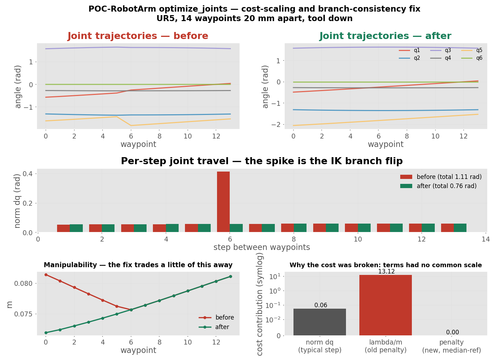

# Experiments

Reproducible measurements backing non-obvious changes. Each is a script under
`scripts/` that regenerates its own figure, so the numbers can be re-checked
rather than trusted.

## optimize_joints — cost scaling and branch consistency

```bash
python scripts/experiment_optimizer_cost.py [<before-commit-ish>]
```



Loads the pre-fix `optimize_joints` straight out of git history and runs it
beside the current one over identical waypoints — a UR5, 14 waypoints 20 mm
apart, tool pointing down.

```
before (55fc0f1^): travel=1.112 rad  max step=0.413  mean manip=0.0786
after:             travel=0.761 rad  max step=0.061  mean manip=0.0762
  -> travel 32% lower, worst step 6.7x smaller, manipulability -3.0%
```

**What each panel shows**

- *Top* — the IK branch flip. Before, `q1` and `q5` kink sharply at waypoint 6
  because candidate index `k` was not tracking one branch. After, every joint
  is smooth.
- *Middle* — that flip as a single 0.413 rad spike in an otherwise flat 0.06
  profile. Almost the entire travel difference is that one step.
- *Bottom left* — **the trade.** The old cost did buy genuinely higher
  manipulability early in the path. The fix gives up about 3% of it.
- *Bottom right* — why the old cost was broken. A typical step contributes
  0.06; the old `lambda/m` term contributed 13.1, some 200x more, so the DP was
  optimising manipulability alone. The median-referenced penalty charges a
  typical candidate nothing.

The trade is the point worth arguing about: 3% mean manipulability for a 6.7x
smaller worst step and 32% less travel. That is the right direction for a
redundancy resolver — the old behaviour paid an unbounded amount of smoothness
for marginal manipulability — but it is a trade, not a free win. If an
application genuinely needs manipulability maximised regardless of motion
quality, raise `manip_weight`; the penalty is now on a scale where that means
something predictable.
